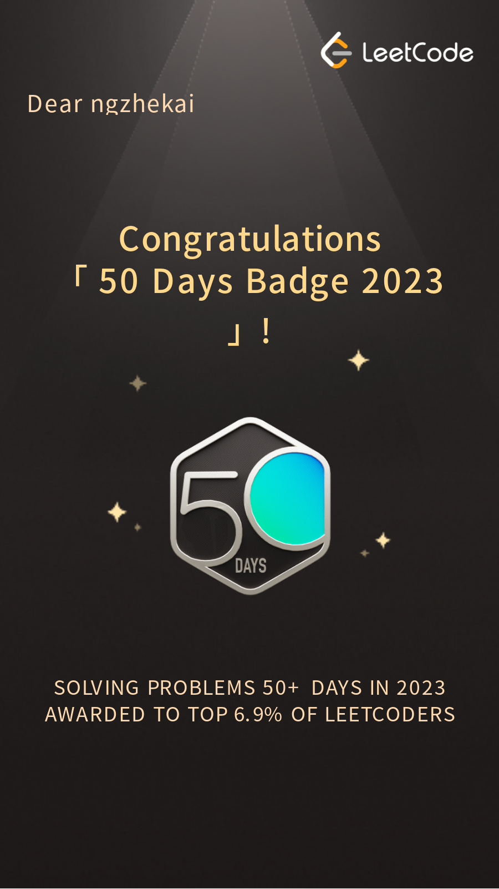

 

<h3 align=center> <b><q>Exceptional thinkers ignore their critics and go about their business making history.</q></b> -<em>John Eliot</em> </h3> 
 <blockquote> Updated on 01/03/2024 - (UTC) 00:29:22</blockquote> 

---

  
 

